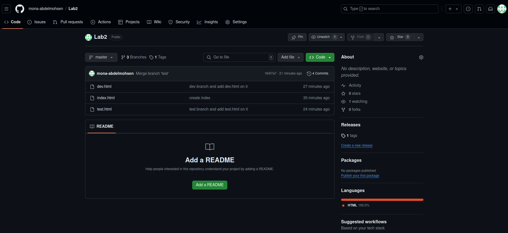

# Lab2

>>## Q4) Tell me how to remove them locally and remotely.
##
    -> Remove them locally 
        -> git branch -d dev
        -> git branch -d test

    -> Remove them Remotely 
        -> git branch :dev (git branch --delete dev)
        -> git branch :test (git branch --delete test)

>>## Q5) Tell me how to checkout another branch without commit changes.
##
    -> git stash

>>## Q8) Tell me how to list tags.
##
    -> git tag

>>## Q9) Tell me how to delete tag locally and remotely.
##
    -> Remove tag locally 
        -> git tag -d v1.0

    -> Remove tag Remotely 
        -> git push origin --delete v1.0
        -> git push origin :v1.0

## Q10) My Repo

